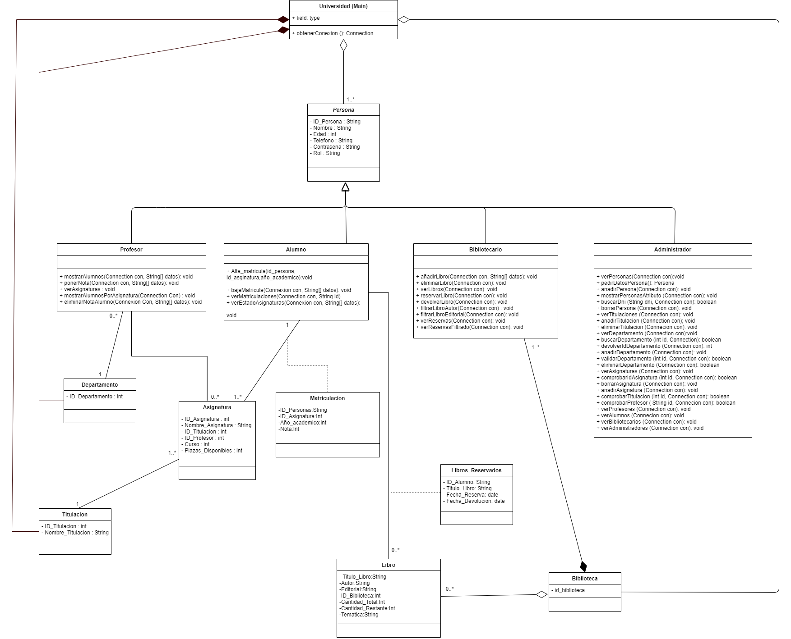
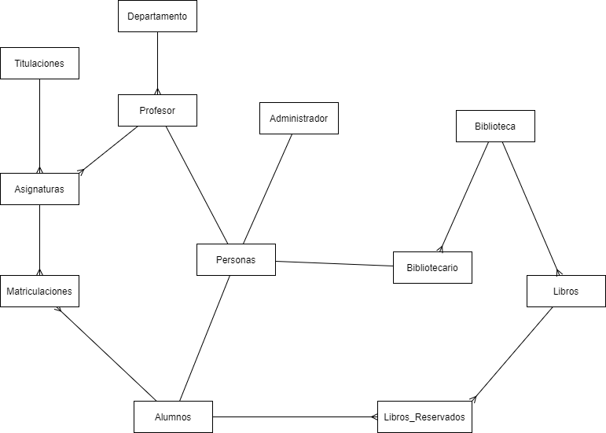
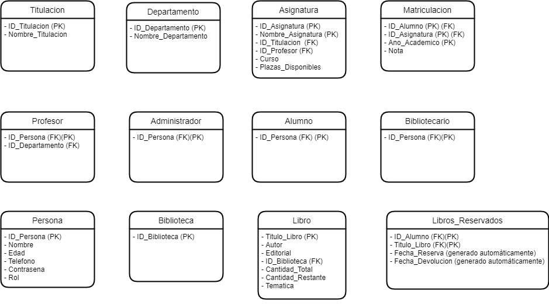

# Proyecto 3a evaluacion - Default_Name
## Proyecto.
* En este proyecto hacemos la gestion de una universidad incluyendo su biblioteca. 
* El objetivo principal de este proyecto es el aprendizaje y cumplir los objetivos propuestos por product owner.

## Sprints.
|Tarea              |Asignados  | Horas reales | Horas estimadas|
|---                | ---            | ---              |   ---      |
|  **Sprint 1**       |               |**Fecha inicio:** 24/03/2021|**Fecha fin:** 19/04/2021|
|#5 Estudiar java      |César, Enrique  |10 horas |15 Horas  |
|#4 Estudiar acceso BBDD      |Alberto, Franco  |12 horas           |15 Horas     |
|#3 Estudiar interfaz gráfica      |Alfonso, Julia       |15 horas              |15 Horas     |
|#2 Diseñar tablas BBDD     |Todos |4 horas           |3 Horas     |
|#1 Diseño del diagrama de BBDD      |Todos |12 horas           |6 Horas     |
|  **Sprint 2**      |               |**Fecha inicio:** 19/04/2021|**Fecha fin:** 26/04/2021|
|#7 Instalar y prepararse todos el UltraVCN      |Todos  |0.5 horas           |0.5 Horas     |
|#6 Compartir conocimiento con el grupo      |Todos  |8 horas           |10 Horas     |
|#8 Discutir funcionamiento interno de la aplicación y preparar base para empezar     |Todos  |12 horas           |6 Horas  |
|#9 Insertar tablas en mysql      |Franco  |3 horas           |1.5 Horas     |
|#36 Métodos clase administrador verProfesores, verAdministradores, verAlumnos, verBibliotecarios      |Julia  |2 horas           |3 Horas     |
|  **Sprint 3**      |               |**Fecha inicio :** 26/04/2021|**Fecha fin:** 05/05/2021|
|#27 Cambiar Ñ por N     |Enrique |0.5 horas           |0.5 Horas     |
|#21 Crear profesor     |Alberto |0.5 horas           |0.5 Horas     |
|#18 Crear administrador     |Alberto  |0.5 horas           |0.5 Horas     |
|#20 Crear bibliotecario     |Franco  |1 horas           |0.5 Horas     |
|#13 Crear departamento     |Enrique |0.5 horas           |0.5 Horas     |
|#19 Crear alumno     |Cesar  |1.5 horas   |0.5 Horas     |
|#12 Crear clase asignatura     |Cesar  |0.5 horas           |0.5 Horas     |
|#14 Crear biblioteca     |Julia  |0.25 horas           |0.5 Horas     |
|#11 Crear clase titulaciones     |Alberto  |0.25 horas           |0.5 Horas     |
|#10 Crear clase Libros reservados     | Enrique  |0.5 horas           |0.5 Horas     |
|#16 Crear clase matriculaciones     |Enrique  |0.25 horas           |0.5 Horas     |
|#15 Crear clase Libros     |Alberto  |0.25 horas           |0.5 Horas     |
|#17 Crear clase personas(abstracta)     |Julia  |0.25 horas           |0.5 Horas     |
|  **Sprint 4**     |               |**Fecha inicio :** 05/05/2021|**Fecha fin:** 20/05/2021|
|#33 Métodos clase profesor mostrar alumnos por asignatura    |Cesar |~ horas |4 Horas     |
|#31 Actualizar base de datos   |Franco |1 horas           |1 Horas     |
|#25 Métodos clase profesor verAlumnos poner una nota    |Alberto | horas | Horas |
|#29 Métodos clase administrador mostrar personas    |Julia | 1.5 horas |1.5  Horas |
|#28 Métodos clase administrador añadir y eliminar personas    |Julia | 5.5 horas           | 2 Horas     |
|#30 Modificar hijos de persona    |Alberto | horas           | Horas     |
|#22 Insertar tablas e información en la máquina remota    |Enrique, Julia | 1.5 horas           | 1 Horas     |
|#26 Arreglar clase asignatura  |Alberto | horas           | Horas     |
|#23 Crear obtener conexion en main |Julia |0.5  horas           | 0.5 Horas     |
|#37 Metodo clase administrador ver departamentos anadirdepartametos eliminar departamentos |Julia |5  horas           | 2 Horas     |
|  **Sprint 5**     |               |**Fecha inicio :** 20/05/2021|**Fecha fin:** 31/05/2021|
|#24 Métodos clase alumno altaMatricula |Franco |5 horas           |3 Horas     |
|#44 Métodos clase bibliotecario  devolver Libro |Cesar |4 horas           |3 Horas     |
|#45 Métodos bibliotecario verReservas, verReservasFiltrado |Julia | 2 horas           | 3 Horas     |
|#41 Métodos clase alumno bajaMatricula |Enrique |3 horas  |2 Horas     |
|#34 Métodos clase admin verAsignaturas, añadirAsignaturas, eliminarAsignaturas |Julia | 5 horas           | 3 Horas     |
|#43 Métodos clase bibliotecario reservarLibros |Alberto | horas           | Horas     |
|#51 subir información BBDD remota |Alfons |1 horas           |1 Horas     |
|#40 Métodos clase bibliotecario verLibros, eliminarLibros , anadirLibros |Alberto | horas           | Horas     |
|#35 Métodos clase admin vertitulaciones, añadirtitulaciones , eliminartitulaciones |Enrique |2.5 horas  |2 Horas     |
|  **Sprint 6**     |               |**Fecha inicio :** 31/05/2021|**Fecha fin:** 07/06/2021|
|#52 Realizar main |Alberto | horas           | Horas     |
|#42 Realizar readme |Alfons, Julia |6 horas |5 Horas |
|#57 Poner insert en la BBDD |Julia | 0.5 horas           | 0.5 Horas     |
|#59 Arreglar BBDD |Franco |1.5 horas           |1 Horas     |
|#39 Métodos clase eliminarNotaAAlumno  |Julia | 1 horas           |1  Horas     |
|#58 Reparar método poner nota  |Julia | 0.25 horas           | 0.25 Horas     |
|#38 Métodos clase alumno ver estado asignaturas  |Enrique, Alfons |2 horas|2 Horas |
|#56 Añadir javadoc donde falte  |Alfons |0.5 horas  |0.5 Horas     |
|#55 Crear scanner global en las clases y cambiar funciones que lo tenga | Alfons |0.25 horas           |0.5 Horas     |
|#54 Eliminar throws |Alfons |0.5 horas           |0.5 Horas     |
|#48 Métodos clase bibliotecario filtrarLibrosPorAutor |Alberto | horas           | Horas     |
|#49 Métodos clase bibliotecario filtrarLibrosPorTematica |Alfons |2.5 horas           |3 Horas     |
|#47 Métodos clase bibliotecario filtrarLibrosPorEditorial |Julia | 1 horas           | 1 Horas     |

## Guia.
Esta aplicación intenta llevar la gestion de una universidad.

* UML:

* ESQUEMA DE LA BASE DE DATOS:

* TABLAS DE LA BASE DE DATOS:

La aplicación consta de un centralizado en las clases descendientes de persona, que vienen a ser los roles como vease administrador, profesor...   
Para inicializar en la aplicacion se hace una identificacion, la cual detecta si el usuario que esta iniciando sesion existe en la base de datos o no. Después segun su rol, se le enseñara un menú distinto el qual le permitirà realizar diferentes acciones, algunos ejemplos:
* Alumno: Ver el estado de las asignaturas o darse de alta o baja en una matricula.
* Profesor: Ver notas de algun alumno o poner notas.
* Administrador: Crear, ver o eliminar asignaturas, departamentos, titulaciones y demas.
* Biblotecario: Crear y eliminar libros, filtraje de estos y reservarlos y devolverlos para los alumnos.

## Conceptos y conocimientos usados para realizar la aplicacion.
Los conocimientos y conceptos usados para realizar esta aplicación son:
* Conceptos basicos y generales del lenguaje de Java.
* Conceptos mas especificos en Java: Conexion a la base de datos y exportacion de la informacion en ficheros TXT y PDF.
* Metodologia SCRUM.
* Conociminetos de BBDD en esquema relacional y SQL.
* Conocimientos sobre UML.
* Conocimineto sobre MD.

## Integrantes.
* **SCRUM MASTER:** Alfons Lorente Darder.
* **SCRUM TEAM:** 
    * Julia Jaca Estepa.
    * Enrique Manuel Grao Sánchez.
    * César Andrés Granda Henríquez.
    * Franco Paolo Peri Bustos.
    * Alberto Serrano Ruiz.
* **PRODUCT OWNER:** Rafael Gion Muñoz.